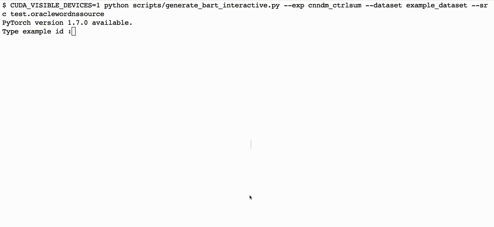

# CTRLsum
This is PyTorch implementation of the [paper](https://arxiv.org/abs/2012.04281):

```
CTRLsum: Towards Generic Controllable Text Summarization
Junxian He, Wojciech Kryściński, Bryan McCann, Nazneen Rajani, Caiming Xiong
arXiv 2020
```

This repo includes instructions for [using pretrained CTRLsum models](#example-usage-of-pretrained-models) as well as [training new models](#train-ctrlsum). 

CTRLsum is a generic controllable summarization system to manipulate text summaries given control tokens in the form of keywords or prefix. CTRLsum is also able to achieve strong (e.g. state-of-the-art on CNN/Dailymail) summarization performance in an uncontrolled setting. 

🎥 Demo1: [](https://huggingface.co/spaces/akhaliq/ctrl-sum)(to interactively generate using the pretrained model)

🎥 [Demo2](https://share.streamlit.io/jxhe/ctrlsum-demo/ctrlsum_demo.py)(to navigate the CTRLsum outputs used in our experiments) 


## Model checkpoints

Dataset | Dowload
---|---
CNN/DailyMail | [download (.tar.gz)](https://storage.googleapis.com/sfr-control-summ-data-research/cnndm_ctrlsum.tar.gz)
arXiv | [download (.tar.gz)](https://storage.googleapis.com/sfr-control-summ-data-research/arxiv_ctrlsum.tar.gz)
BIGPATENT | [download (.tar.gz)](https://storage.googleapis.com/sfr-control-summ-data-research/big_patent_ctrlsum.tar.gz)

These checkpoints are also available in [huggingface transformers](https://github.com/huggingface/transformers), see details [below](#option-3-through-huggingface-transformers).

## Updates

**October 07, 2021**

Integrated to [Huggingface Spaces](https://huggingface.co/spaces) with [Gradio](https://github.com/gradio-app/gradio). See demo: [](https://huggingface.co/spaces/akhaliq/ctrl-sum)

**June 18, 2021**

We released another Web UI Demo ([here](https://share.streamlit.io/jxhe/ctrlsum-demo/ctrlsum_demo.py)) to navigate most of CTRLsum outputs generated in the experiments of the paper.

**Mar 22, 2021**

[Hyunwoong Ko](https://github.com/hyunwoongko) made a python package, [summarizers](https://github.com/hyunwoongko/summarizers), based on CTRLsum. CTRLsum is also now supported in [huggingface transformers](https://github.com/huggingface/transformers) credited to Hyunwoong Ko. Currently CTRLsum can be easily used with several lines of codes with these packages. See an [example](#option-3-through-huggingface-transformers) using huggingface transformers.


## Dependencies
The code requires Python 3, [PyTorch](https://pytorch.org/) (>=1.4.0), and [fairseq](https://github.com/pytorch/fairseq) (the code is tested on this [commit](https://github.com/pytorch/fairseq/commit/fad3cf0769843e767155f4d0af18a61b9a804f59))

Install dependencies:
```bash
# manually install fairseq
git clone https://github.com/pytorch/fairseq

# this repo is tested on a commit of fairseq from May 2020:
# fad3cf0769843e767155f4d0af18a61b9a804f59
cd fairseq
git reset --hard fad3cf07

# the BART interface in fairseq does not support prefix-constrained decoding
# as of creating this README, thus we need to make several modifications to 
# fairseq before installing it
cp ../ctrlsum/fairseq_task.py fairseq/tasks/fairseq_task.py
cp ../ctrlsum/sequence_generator.py farseq/
cp ../ctrlsum/hub_interface.py fairseq/models/bart/

# install fairseq
pip install --editable ./

cd ..

# install other requirements
pip install -r requirements.txt
```

## Example Usage of Pretrained Models


### Option 1. Generate summaries in an interactive way, users can specify the control tokens (keywords, prompts, or both):

```bash 
CUDA_VISIBLE_DEVICES=xx python scripts/generate_bart_interactive.py --exp [checkpoint directory] \
	--dataset example_dataset \
	--src test.oraclewordnssource
```
The command above reads source articles from `datasets/example_dataset/test.oraclewordnssource`, users can then interact with the system in the commandline by inputting the id of examples to be shown, as well as the control tokens: 




### Option 2. Generate summaries from a file which includes keywords:

```bash
# the following command generates summaries from `datasets/example_dataset/test.oraclewordnssource`
# the input data format is concatenated keywords and source with sep token, please refer to the 
# given example data files for examples
# the predicted summaries are saved into the checkpoint directory
CUDA_VISIBLE_DEVICES=xx python scripts/generate_bart.py --exp [checkpoint directory] \
	--dataset example_dataset \
	--src test.oraclewordnssource 
```

### Option 3. Through Huggingface Transformers
Our pretrained model checkpoints are available in [huggingface transformers](https://github.com/huggingface/transformers), the model names are: `hyunwoongko/ctrlsum-cnndm`, `hyunwoongko/ctrlsum-arxiv`, and `hyunwoongko/ctrlsum-bigpatent`. An example code snippet (quoted from [here](https://github.com/huggingface/transformers/issues/9001#issuecomment-803613963)):

> ### 1. Create models and tokenizers
> ```python
> >> from transformers import AutoModelForSeq2SeqLM, PreTrainedTokenizerFast
> 
> >>> model = AutoModelForSeq2SeqLM.from_pretrained("hyunwoongko/ctrlsum-cnndm")
> >>> # model = AutoModelForSeq2SeqLM.from_pretrained("hyunwoongko/ctrlsum-arxiv")
> >>> # model = AutoModelForSeq2SeqLM.from_pretrained("hyunwoongko/ctrlsum-bigpatent")
> 
> >>> tokenizer = PreTrainedTokenizerFast.from_pretrained("hyunwoongko/ctrlsum-cnndm")
> >>> # tokenizer = PreTrainedTokenizerFast.from_pretrained("hyunwoongko/ctrlsum-arxiv")
> >>> # tokenizer = PreTrainedTokenizerFast.from_pretrained("hyunwoongko/ctrlsum-bigpatent")
> ```
> 
> ### 2. Unconditioned summarization
> ```python
> >>> data = tokenizer("My name is Kevin. I love dogs. I loved dogs from 1996. Today, I'm going to walk on street with my dogs", return_tensors="pt")
> >>> input_ids, attention_mask = data["input_ids"], data["attention_mask"]
> >>> tokenizer.batch_decode(model.generate(input_ids, attention_mask=attention_mask, num_beams=5))[0]
> '</s>My name is Kevin. I loved dogs from 1996.</s>'
> ```
> 
> ### 3. Conditioned summarization
> * You can input condition token using `TOKEN => CONTENTS` structure
> 
> ```python
> >>> data = tokenizer("today plan => My name is Kevin. I love dogs. I loved dogs from 1996. Today, I'm going to walk on street with my dogs", return_tensors="pt")
> >>> input_ids, attention_mask = data["input_ids"], data["attention_mask"]
> >>> tokenizer.batch_decode(model.generate(input_ids, attention_mask=attention_mask, num_beams=5))[0]
> "</s> Today, I'm going to walk on street with my dogs. I loved dogs from 1996</s>"
> ```
> 
> ### 4. Prompt summarization
> * You can also input `decoder_input_ids` for input prompt.
> 
> ```python
> >>> data = tokenizer("Q:What is my name? A: => My name is Kevin. I love dogs. I loved dogs from 1996. Today, I'm going to walk on street with my dogs", return_tensors="pt")
> >>> input_ids, attention_mask = data["input_ids"], data["attention_mask"]
> >>> tokenizer.batch_decode(model.generate(input_ids, attention_mask=attention_mask, num_beams=5, decoder_input_ids=tokenizer("Q:What is My name? A:", return_tensors="pt")["input_ids"][:, :-1]))[0]
> '<s>Q:What is My name? A: Kevin.</s>'
> ```

### Option 4. Through the Summarizers Python Package
 The python package [summarizers](https://github.com/hyunwoongko/summarizers) allows you to use the pretrained CTRLsum with several lines of code. 


## Train CTRLsum

### Data Processing

Prepare your data files into `datasets/[dataset name]`, which should consist of six data files as `[train/val/test].[source/target]`. These data files are raw text with each row representing one example. We take `cnndm` dataset as an example to preprocess the dataset (see [here](https://github.com/pytorch/fairseq/blob/master/examples/bart/README.summarization.md) for instructions to obtain the cnndm dataset): 

```bash
# this command runs the preprocessing pipeline including tokenization, truncation, and 
# keywords extraction. It will generate all required data files to train CTRLsum into 
# `datasets/cnndm`. Example obtained files can be found in `datasets/example_dataset`
# Some optional arguments can be found in preprocess.py
python scripts/preprocess.py cnndm --mode pipeline

# gpt2 encoding
bash scripts/gpt2_encode.sh cnndm

# binarize dataset for fairseq
bash scripts/binarize_dataset.sh cnndm
```

For the generated files in the `datasets/cnndm`, the suffix `oracleword` represents the keywords (after keyword dropout) file,   `oraclewordsource` represents the concatenated keywords and source. `oraclewordns` represents the original keywords without keyword dropout. The `.jsonl` files are potentially used to train the tagger later.

### Train the summarization model on multiple GPUs:

```
bash scripts/train_bart.sh -g [GPUs] -d [dataset name] -b [bart checkpoint path (.pt file)]
```
`GPUs` are GPU ids separated by `,`. All our experiments are on 8 GPUs accumulating 8 gradient steps, resulting in an effective batch size of 1024x8x8 tokens in total. You propably need to increase the `update_freq` variable in `train_bart.sh` if you use less GPUs to match the effective batch size. The saved models are in dir `checkpoint`. The training arguments can be found in `train_bart.sh`.


### Train the keyword tagger (optional):
Note that the keyword tagger is required only in uncontrolled summarization setting and certain control settings which require automatic keywords (like length control in the paper)
```bash
# this requires to give 4 gpus for training by default,
# you need to change the --nproc_per_node value if you 
# train with different number of gpus
bash scripts/train_seqlabel.sh -g [GPUs] -d [dataset name]
```

The effective batch size we used for different datasets can be found in the training script as `number of gpus x batch x uddate_freq`


## Evaluate CTRLsum
Here we include evaluation for uncontrolled summarization settings. 

### Obtain automatic keywords from a trained tagger:

```bash
# run prediction from the tagger which outputs confidence values for every token
# `checkpoint directory` is the directory that contains the `pytorch_model.bin` checkpoint.
# the results are saved in the checkpoint directory as test_predictions.txt
bash scripts/train_seqlabel.sh -g [GPUs] -d [dataset name] -p [checkpoint directory]


# obtain keywords by selecting confident words, `threshold, maximum-word, and summary-size` 
# are three hyperparameters in this step, please check Appendix A in the paper for specific
# values we used for different datasets, the performance is relatively robust
# this command will yield a file `.predwordsource` in `datasets/[dataset name]` which can be
# used as input to the summarization model to obtain uncontrolled summaries
python scripts/preprocess.py [dataset name] \
		--split test \
		--mode process_tagger_prediction \
		--tag-pred [the tagger prediction file path, named as test_predictions.txt] \
		--threshold [confidence threshold] \
		--maximum-word [maximum number of keywords] \
		--summary-size [number of sentences from which to identify keywords]
```


### Metrics:

We report ROUGE scores and [BERTScore](https://github.com/Tiiiger/bert_score) in the paper. The ROUGE scores in the paper are computed using [files2rouge](https://github.com/pltrdy/files2rouge) which is a wrapper of a wrapper of the original ROUGE perl scripts. Please refer to `scripts/test_bart.sh` for our evaluation script:

```bash
# you will need the Stanford corenlp java toolkit to run this, we use it for tokenization
# this script computes ROUGE and (optionally) BERTScore.
bash scripts/test_bart.sh -g [GPUs] -s [source file name, NOT full path] -d [dataset] -p [ctrlsum checkpoint directory]
```

## Citation

```
@article{he2020ctrlsum,
title={{\{}CTRL{\}}sum: Towards Generic Controllable Text Summarization},
author={He, Junxian and Kry{\'s}ci{\'n}ski, Wojciech and McCann, Bryan and Rajani, Nazneen and Xiong, Caiming},
journal={arXiv},
year={2020}
}
```

